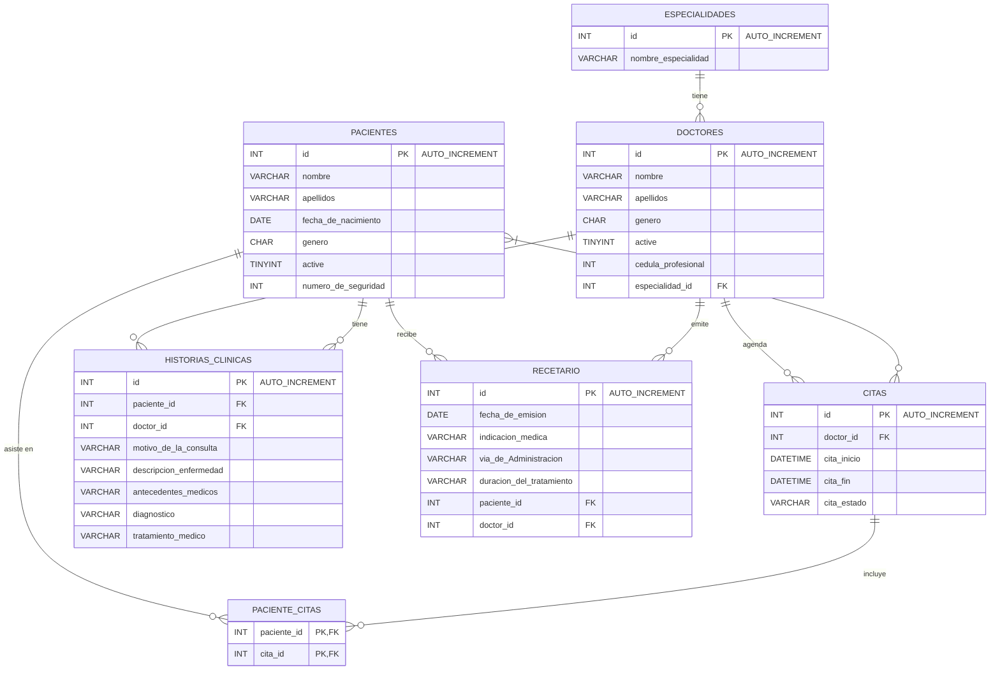

# Cardiology Health Care Management System

Sistema de gestión hospitalaria , desarrollado con Java y Maria DB.
Permite administrar pacientes, médicos, citas, historiales clínicos y recetas médicas.

## Descripción

Aplicación web diseñada para la administración integral de las citas médicas.

Funciones principales:
- Gestión de pacientes
- Gestión de médicos
- Agenda de citas
- Gestión de Historias Clinicas
- Recetas médicas
- Reportes PDF
- Seguridad por roles

## Arquitectura

Patrón MVC + Service + Repository

Controller
↓
Service
↓
Repository
↓
Database

## 🛠 Tecnologías utilizadas


## Entidades principales

- Paciente
- Doctor
- Especialidad
- Cita
- Historia Clínica
- Receta
- UserInfo
- UserInfoRole



## 🚀 Instalación

Sigue estos pasos para ejecutar el proyecto localmente.

### Requisitos previos

Asegúrate de tener instalado:

* **Java JDK 17**
* **Apache Maven 3.9+**
* **MariaDB 10+**
* **Git**
* Un IDE compatible:

  * IntelliJ IDEA
  * Spring Tool Suite (STS)
  * Eclipse

---

## 1) Clonar repositorio

```bash
git clone <URL_DEL_REPOSITORIO>
cd mher-system
```

---

## 2) Crear base de datos

Crear una base de datos en MariaDB:

```sql
CREATE DATABASE mher_system;
```

---

## 3) Configurar conexión a base de datos

Editar:

```properties
src/main/resources/application.properties
```

Configurar:

```properties
spring.datasource.url=jdbc:mariadb://localhost:3306/mher_system
spring.datasource.username=tu_usuario
spring.datasource.password=tu_password
spring.datasource.driver-class-name=org.mariadb.jdbc.Driver

spring.jpa.hibernate.ddl-auto=update
spring.jpa.show-sql=true
spring.jpa.properties.hibernate.format_sql=true
```

---


## 4) Instalar dependencias

Compilar proyecto:

```bash
mvn clean install
```

o usando Maven Wrapper:

```bash
./mvnw clean install
```

Windows:

```bash
mvnw.cmd clean install
```

---

## 5) Inicializar roles del sistema

Crear registros iniciales de roles:

* `ADMIN`
* `USER`

Estos roles son obligatorios para el funcionamiento del sistema de autenticación y autorización implementado con Spring Security.

---

## 6) Crear usuario administrador inicial

Antes de usar la aplicación se debe crear un usuario administrador inicial.

Usuario recomendado:

```text
Nombre: Admin
Apellido: Admin
Correo: admin@gmail.com
Password: admin
Rol: ADMIN
Estado: Activo
```

Este usuario tendrá permisos para:

✅ crear usuarios
✅ asignar roles
✅ administrar médicos
✅ administrar pacientes
✅ administrar citas
✅ administrar historial clínico
✅ administrar recetas médicas

---

## 7) Ejecutar aplicación

Desde terminal:

```bash
mvn spring-boot:run
```

o ejecutar la clase principal:

```java
MherSystemApplication.java
```

---

## 8) Abrir aplicación

Abrir navegador:

```text
http://localhost:8080/
```

Login:

```text
usuario: admin@gmail.com
password: admin
```

---

## Roles del sistema

### ADMIN

Acceso total al sistema.

### USER

Acceso limitado a funcionalidades administrativas básicas del médoco, como generar doumentación del paciente.


---

## Notas

El proyecto utiliza:

* Spring Security 6
* BCrypt Password Encoder
* Thymeleaf Security Extras
* JPA / Hibernate
* MariaDB
* OpenPDF
* Spring Mail

---
## Autor

Oswaldo Casique Arzate  
.NET Developer  
Backend Developer  


